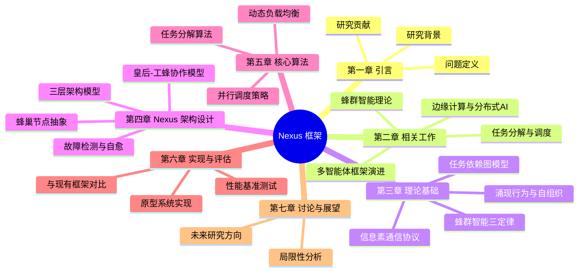
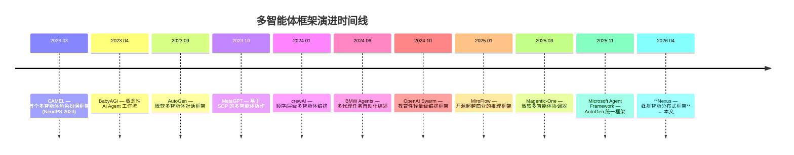
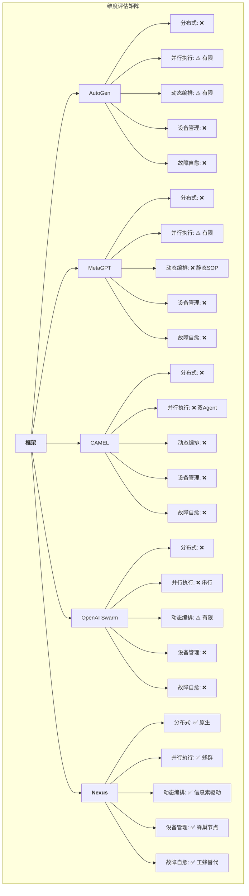
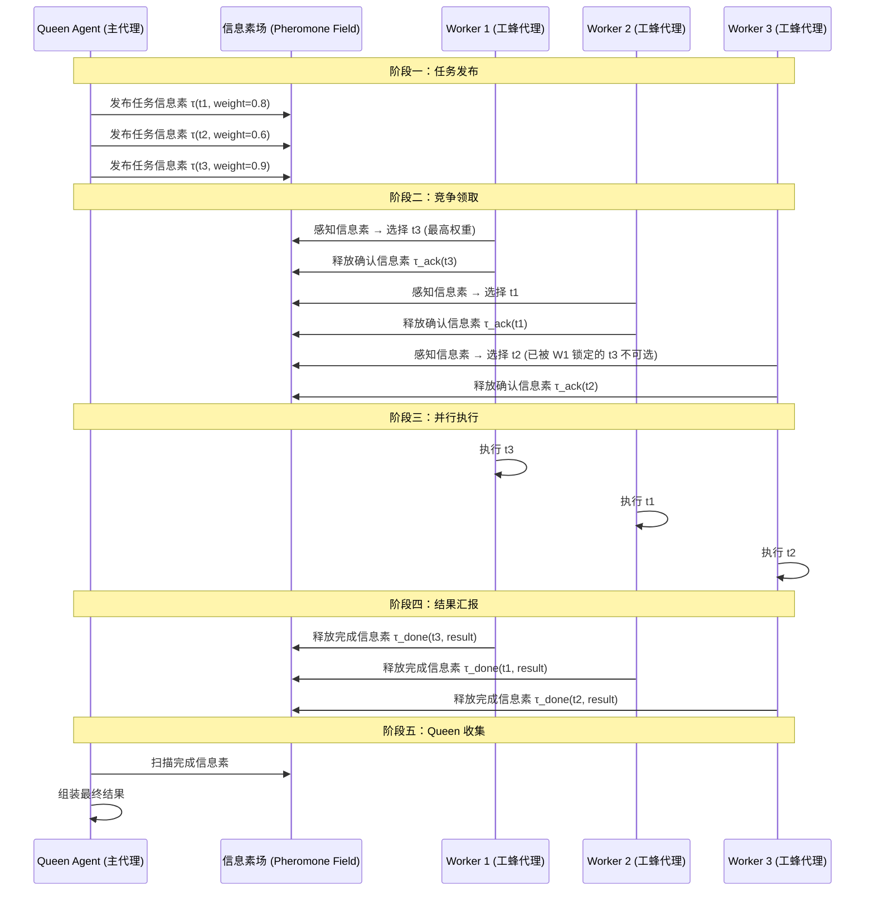
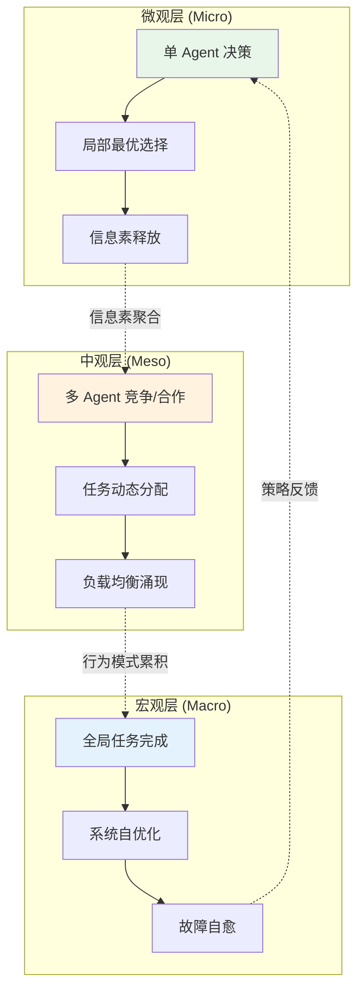
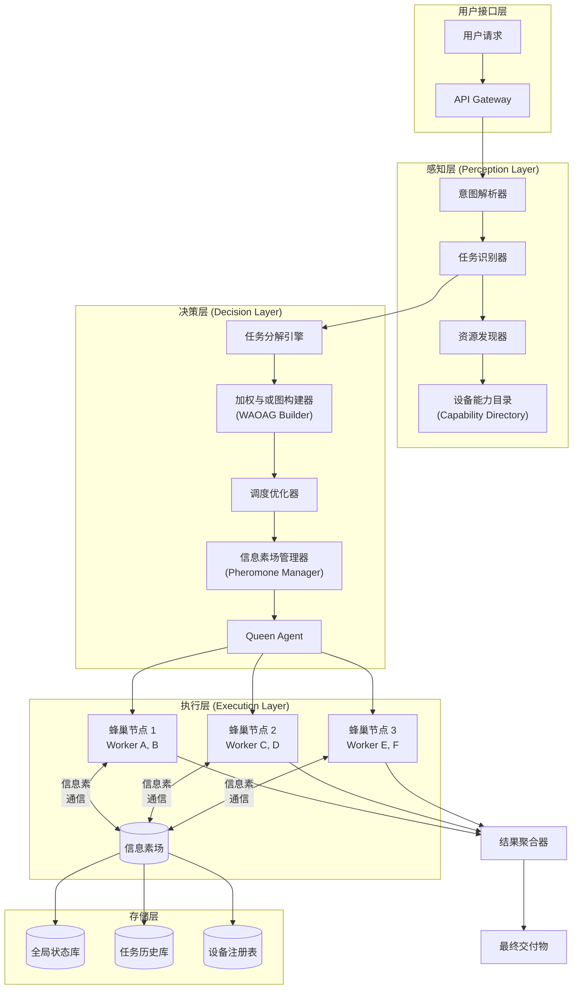
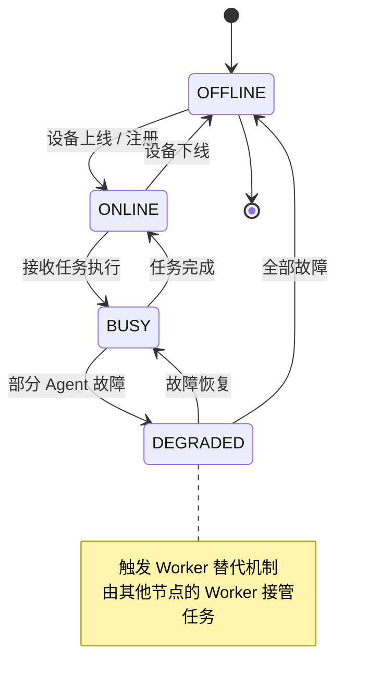
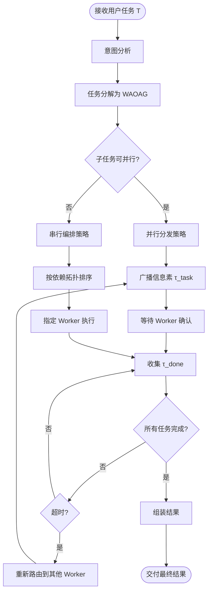
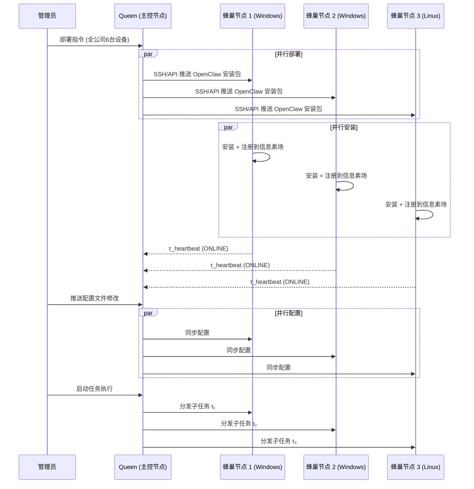
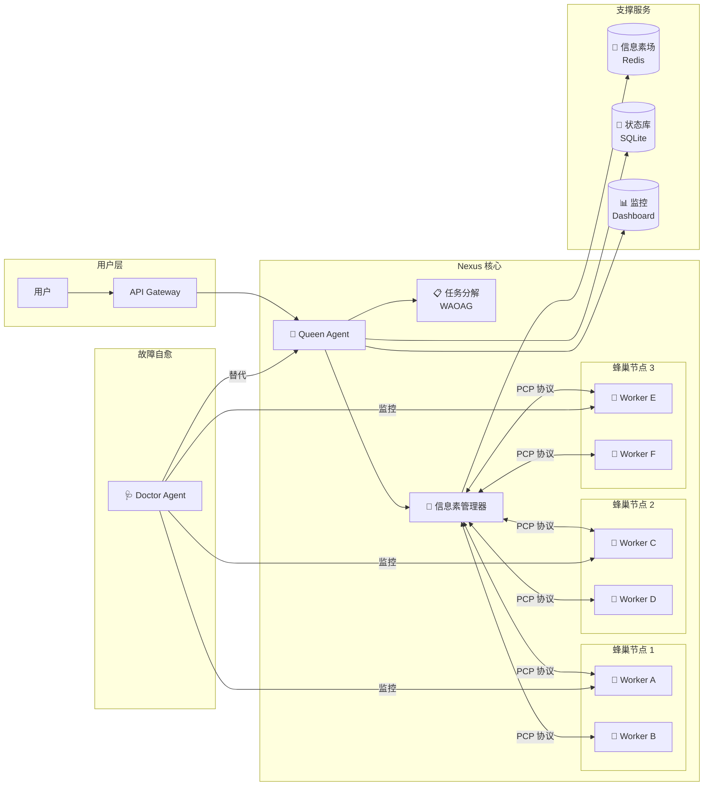

# Nexus: 基于蜂群智能的分布式多智能体协作框架

## A Swarm-Intelligence Framework for Distributed Multi-Agent Collaboration

---

**摘要 Abstract**

当前大型语言模型（LLM）驱动的多智能体系统研究正处于快速发展阶段，但现有框架（如 AutoGen、MetaGPT、CAMEL、OpenAI Swarm）主要聚焦于**单机环境下的代理编排**，缺乏对**物理分布式设备**的原生支持、**异构计算资源的统一调度**，以及**蜂群式自组织协作**的理论基础。本文提出 **Nexus** —— 一个基于蜂群智能（Swarm Intelligence）理论的分布式多智能体协作框架。Nexus 将多台物理计算设备抽象为"蜂巢节点"（Hive Node），由主代理（Queen Agent）统一编排，子代理（Worker Agent）在各节点上并行执行任务，并通过**信息素通信协议**（Pheromone Communication Protocol）实现去中心化的状态同步与动态负载均衡。本文系统梳理了多智能体系统的理论演进，提出了 Nexus 的三层架构模型（感知层-决策层-执行层），设计了基于加权与或图的任务分解算法，并通过分布式设备管理、跨节点协作和故障自愈机制展示了框架的工程可行性。

**关键词**：分布式多智能体系统；蜂群智能；大语言模型；任务编排；边缘计算；信息素通信

---

## 目录



---

## 第一章 引言

### 1.1 研究背景

大型语言模型（LLM）的突破性发展催生了以 Agent 为核心的智能应用范式。从单智能体的工具调用（ReAct, Yao et al., 2023）到多智能体的协作对话（AutoGen, Wu et al., 2023），研究者逐步认识到：**多个专业化代理的协作，能够突破单一模型的能力边界，完成更复杂的任务**。

然而，当前主流多智能体框架存在三个根本性局限：

| 局限 | 现状 | Nexus 解法 |
|------|------|-----------|
| **物理耦合** | 框架运行于单进程/单机 | 原生支持跨设备分布式部署 |
| **静态编排** | 预定义代理角色和工作流 | 基于蜂群智能的动态自组织 |
| **中心化瓶颈** | 单一 Orchestrator 承载全部决策 | 信息素协议驱动的去中心化协调 |

### 1.2 问题定义

**核心问题**：如何构建一个支持**物理分布式设备**、**动态任务编排**、**去中心化状态协调**的多智能体协作框架？

形式化定义如下：

> 给定一个由 $N$ 台异构计算设备组成的集群 $\mathcal{D} = \{d_1, d_2, \ldots, d_N\}$，每台设备 $d_i$ 上运行若干 Agent $\{a_{i,1}, a_{i,2}, \ldots, a_{i,k_i}\}$。对于用户提交的复杂任务 $T$，Nexus 需要：
> 1. 将 $T$ 分解为可并行/串行执行的子任务集 $\{t_1, t_2, \ldots, t_m\}$
> 2. 将子任务动态分配给最优 Agent 执行
> 3. 通过信息素协议实现状态同步与故障恢复
> 4. 收集结果并组装为最终交付物

### 1.3 研究贡献

本文的原创贡献包括：

1. **蜂群智能驱动的多智能体理论框架**：将经典蜂群智能（PSO, ACO, Bee Algorithm）与 LLM Agent 范式融合，提出"皇后-工蜂"协作模型
2. **信息素通信协议（PCP）**：一种轻量级的跨设备状态同步机制，支持异步、去中心化的Agent间协调
3. **三层架构模型**：感知层（Perception）→ 决策层（Decision）→ 执行层（Execution），实现设备抽象与任务编排的解耦
4. **动态任务分解算法**：基于加权与或图（WAOAG）的任务建模与调度策略
5. **分布式设备统一管理**：一套协议实现跨 Windows/Linux/macOS 设备的 Agent 部署、配置同步与远程控制

---

## 第二章 相关工作

### 2.1 多智能体框架演进图谱



### 2.2 现有框架深度对比

#### 2.2.1 AutoGen（Microsoft Research, 2023）

AutoGen 是 LLM 多智能体领域的奠基性工作（Wu et al., 2023）。其核心设计为 **ConversableAgent** 抽象和 **GroupChat** 编排机制，支持代理间多轮对话、工具调用和人类介入。

**优势**：对话式协作自然；生态丰富；v0.4 引入异步事件驱动架构。

**局限**：
- 仅支持**单进程内**的代理编排，无原生分布式支持
- GroupChat 模式在代理数超过 10 个时效率显著下降
- 无设备管理能力，无法统筹多台物理机器

**与 Nexus 的差异**：AutoGen 的 GroupChat 是**中心化轮询**模式，Nexus 的蜂群通信是**去中心化广播**模式。

#### 2.2.2 MetaGPT（Hong et al., 2023）

MetaGPT 提出 "Code = SOP(Team)" 的核心理念，将软件开发的标准操作流程（SOP）编码为多代理协作协议。每个代理对应一个角色（产品经理、架构师、开发工程师等），通过结构化的文档传递（而非对话）实现高效协作。

**优势**：SOP 驱动的结构化通信减少幻觉；角色分工明确。

**局限**：
- SOP 模式局限于软件开发流程，**通用性不足**
- 同样为单机框架，无分布式能力
- 角色定义在初始化时固定，**缺乏动态调整**

**与 Nexus 的差异**：MetaGPT 的 SOP 是**静态工作流**，Nexus 的任务分解是**动态可变**的。

#### 2.2.3 CAMEL（Li et al., 2023, NeurIPS）

CAMEL 是首个基于 ChatGPT 的多智能体协作框架，提出"Inception Prompting"机制，让两个 Agent 在预设角色下自主完成任务。其核心贡献是证明了**角色扮演 + 引导提示**可以实现无需人类干预的 Agent 自主协作。

**优势**：开创性工作；角色扮演范式被后续框架广泛采纳。

**局限**：
- 仅支持**双 Agent** 协作，扩展性有限
- 无任务分解和调度机制
- 通信模式简单，缺乏复杂协调策略

#### 2.2.4 OpenAI Swarm（2024）

OpenAI 的教育性框架，核心概念是 **Routine**（例程）和 **Handoff**（交接）。代理通过 handoff 机制将任务传递给更合适的代理。

**优势**：极简设计；handoff 模式直觉清晰。

**局限**：
- 明确定位为**教育用途**，非生产框架
- Handoff 是**串行**模式，不支持并行执行
- 无设备抽象和分布式支持

#### 2.2.5 框架综合对比



### 2.3 蜂群智能理论基础

蜂群智能（Swarm Intelligence, SI）是计算智能的重要分支，研究由简单个体组成的群体如何通过局部交互产生全局智能行为（Bonabeau et al., 1999）。

**三大经典算法**：

| 算法 | 来源 | 核心机制 | 在 Nexus 中的映射 |
|------|------|---------|------------------|
| 粒子群优化（PSO） | 鸟群觅食 | 个体最优 + 群体最优更新位置 | Agent 的局部决策 + 全局最优策略传播 |
| 蚁群优化（ACO） | 蚂蚁路径选择 | 信息素引导路径选择 | 信息素通信协议（PCP）的理论基础 |
| 蜂群算法（Bee Algorithm） | 蜜蜂采蜜 | 侦查蜂探索 + 采集蜂利用 | Queen 的探索性任务分配 + Worker 的专注执行 |

**关键启发**：自然蜂群没有中央控制器，但通过**信息素（局部化学信号）**、**舞蹈语言（局部物理信号）**和**环境修改（Stigmergy）**实现了高度协调。Nexus 将这些机制**形式化为计算协议**。

### 2.4 任务分解与调度理论

任务分解（Task Decomposition）是多智能体系统的核心能力之一。经典方法包括：

- **与或依赖图**（AND/OR Dependency Graph）：用有向图表示任务间的逻辑关系（Erol et al., 1995）
- **层次任务分析**（Hierarchical Task Analysis, HTA）：将复杂任务递归分解为可执行原子操作
- **带权与或树**（Weighted AND/OR Tree）：为每个子任务分配执行代价和优先级权重

夏宇等（2023）在《Complex & Intelligent Systems》中提出了**动态角色发现与分配**方法，证明了在任务分解过程中动态调整 Agent 角色可以显著提高系统灵活性。Nexus 将此思路扩展为**基于信息素浓度的动态角色演化**机制。

### 2.5 边缘计算与分布式 AI

随着 IoT 设备激增，边缘-云协同架构成为分布式 AI 的重要范式。关键研究方向包括：

- **边缘自治**：在网络中断时维持本地服务运行（OpenYurt, KubeEdge）
- **分层调度**：边缘层（实时）→ 雾层（中等）→ 云层（复杂）的三层调度架构
- **联合学习**：在异构边缘设备上进行分布式模型训练

Nexus 的蜂巢节点抽象借鉴了边缘计算的**设备自治**理念，但将其从 IoT 特定场景推广到**通用 LLM Agent 编排**。

---

## 第三章 理论基础

### 3.1 蜂群智能三定律

本文提出蜂群智能在多智能体系统中的形式化三定律，作为 Nexus 的理论基石：

> **第一定律（涌现定律）**：系统的全局智能行为从简单局部规则中涌现，无需中央控制。
>
> $$\mathcal{G}(t) = \bigoplus_{i=1}^{N} \phi_i(l_i(t))$$
>
> 其中 $\mathcal{G}(t)$ 为 $t$ 时刻的全局行为，$l_i(t)$ 为第 $i$ 个 Agent 的局部状态，$\phi_i$ 为局部决策函数，$\bigoplus$ 为涌现聚合算子。

> **第二定律（信息素定律）**：Agent 间通过环境中的信息素痕迹间接通信，实现去中心化协调。
>
> $$\tau_{i \to j}(t) = \tau_{i \to j}(t-1) \cdot (1 - \rho) + \Delta\tau_i(t)$$
>
> 其中 $\tau$ 为信息素浓度，$\rho$ 为挥发系数（$0 < \rho < 1$），$\Delta\tau_i$ 为第 $i$ 个 Agent 在 $t$ 时刻释放的信息素增量。

> **第三定律（适应性定律）**：系统通过持续的环境反馈调整行为策略，实现自我优化。
>
> $$\pi_i(t+1) = \pi_i(t) + \alpha \cdot \nabla_{\pi} R_i(\pi_i(t), \mathcal{E}(t))$$
>
> 其中 $\pi_i$ 为第 $i$ 个 Agent 的策略，$R_i$ 为奖励函数，$\mathcal{E}(t)$ 为环境状态，$\alpha$ 为学习率。

### 3.2 任务依赖图模型

Nexus 采用**加权与或图（Weighted AND/OR Graph, WAOAG）**对任务进行形式化建模。

**定义 3.1（任务节点）**：一个任务节点 $t$ 是一个四元组 $t = \langle id, \tau, \omega, \mathcal{R} \rangle$，其中：
- $id$：任务唯一标识符
- $\tau \in \{AND, OR, ATOMIC\}$：任务类型（与节点、或节点、原子任务）
- $\omega \in \mathbb{R}^+$：执行权重（预估时间/资源消耗）
- $\mathcal{R} \subseteq \mathcal{A}$：所需 Agent 能力集合

**定义 3.2（任务依赖图）**：任务依赖图 $G = \langle V, E, W \rangle$，其中：
- $V$：任务节点集合
- $E \subseteq V \times V$：依赖边集合（$e_{ij}$ 表示 $t_i$ 的输出是 $t_j$ 的输入）
- $W: E \to \mathbb{R}^+$：边权函数（通信开销）

**定义 3.3（可并行性判定）**：两个任务 $t_i, t_j$ 可并行执行，当且仅当：
$$t_i \not\rightsquigarrow t_j \land t_j \not\rightsquigarrow t_i$$
其中 $\rightsquigarrow$ 表示依赖路径（传递闭包）。

### 3.3 信息素通信协议（PCP）

信息素通信协议（Pheromone Communication Protocol）是 Nexus 的核心协调机制，灵感来自蚁群的信息素路径选择。



**PCP 协议规范**：

| 信息素类型 | 格式 | 含义 | 挥发时间 |
|-----------|------|------|---------|
| `τ_task` | `{task_id, weight, requirements}` | Queen 发布任务 | 永久（直到完成） |
| `τ_ack` | `{agent_id, task_id, timestamp}` | Worker 领取任务 | 永久 |
| `τ_done` | `{task_id, result, metrics}` | Worker 完成任务 | 永久 |
| `τ_heartbeat` | `{agent_id, status, load}` | 心跳存活信号 | 30s |
| `τ_alert` | `{agent_id, error_type, context}` | 异常告警 | 5min |

### 3.4 涌现行为与自组织

Nexus 中的涌现行为体现在三个层面：



**自组织证明**（直觉论证）：

设系统中有 $N$ 个 Worker Agent 和 $M$ 个待执行任务。在 PCP 协议下：
1. 每个 Worker 仅感知局部信息素场（非全局视图）
2. 信息素挥发机制 $\tau(t+1) = \tau(t) \cdot (1-\rho)$ 自然淘汰低效路径
3. 高效完成任务的 Worker 释放更强的信息素，吸引更多关注

因此，系统**无需中央调度器**即可实现近似最优的任务分配——这是经典的自组织涌现现象（Camazine et al., 2001）。

---

## 第四章 Nexus 架构设计

### 4.1 三层架构模型

Nexus 采用**感知-决策-执行**三层架构，实现关注点分离：



### 4.2 蜂巢节点抽象

**定义 4.1（蜂巢节点）**：一个蜂巢节点 $h$ 是一个物理或虚拟计算设备的抽象，定义为：

$$h = \langle id, \mathcal{C}, \mathcal{A}, \sigma, \mathcal{N} \rangle$$

其中：
- $id$：节点唯一标识
- $\mathcal{C} = \langle cpu, mem, gpu, net \rangle$：计算资源容量向量
- $\mathcal{A} = \{a_1, a_2, \ldots, a_k\}$：该节点上运行的 Agent 集合
- $\sigma \in \{ONLINE, BUSY, DEGRADED, OFFLINE\}$：节点状态
- $\mathcal{N} \subseteq \mathcal{D}$：邻接节点集合（网络可达性）

**蜂巢节点管理协议**：



### 4.3 皇后-工蜂协作模型

Nexus 将经典的蜂群分工模式形式化为**皇后-工蜂（Queen-Worker）协作模型**：

| 角色 | 类比自然蜂群 | Nexus 职责 | 实例 |
|------|-------------|-----------|------|
| **Queen Agent** | 蜂后（繁殖与协调） | 任务分解、调度决策、全局状态管理 | 每个任务域一个 Queen |
| **Worker Agent** | 工蜂（采集与建造） | 执行具体子任务、释放信息素 | 每个蜂巢节点 1-N 个 |
| **Scout Agent** | 侦查蜂（探索新资源） | 设备发现、资源探测、新能力注册 | 可选角色 |
| **Doctor Agent** | 护理蜂（照料幼虫） | 状态监控、故障诊断、健康报告 | 系统级角色 |

**Queen 的决策流程**：



### 4.4 故障检测与自愈机制

Nexus 的故障自愈基于**心跳检测 + 工蜂替代**策略：

**故障检测**：
- 每个 Worker 定期（每 30s）释放 `τ_heartbeat` 信息素
- Queen 的信息素管理器监控所有 Worker 的心跳
- 若 Worker 连续 3 次（90s）未释放心跳 → 标记为 `DEGRADED`

**自愈策略**：
1. **本地替代**：同一蜂巢节点上的其他 Worker 接管故障 Worker 的任务
2. **跨节点替代**：若本地无可用 Worker，Queen 将任务信息素重新广播，由其他节点的 Worker 竞争领取
3. **Queen 故障转移**：若 Queen 本身故障，系统中的 Scout Agent 发起新一轮 Queen 选举（基于信息素浓度最高的 Worker 提升为 Queen）

---

## 第五章 核心算法

### 5.1 加权与或图任务分解算法

**算法 5.1：WAOAG-DECOMPOSE**

```
输入: 用户自然语言描述的任务 T
输出: 加权与或图 G = <V, E, W>

1. Queen 接收 T，调用 LLM 进行意图解析
2. 识别任务的原子操作集合 ATOMS = {t₁, t₂, ..., tₙ}
3. 对每对原子任务 (tᵢ, tⱼ):
   a. 判断是否存在数据依赖 (tᵢ → tⱼ)
   b. 判断是否可并行 (无依赖路径)
   c. 计算执行权重 ω(tᵢ) 基于历史数据和预估
4. 构建 WAOAG:
   - 节点: V = ATOMS
   - 边: E = {(tᵢ, tⱼ) | tᵢ 的输出是 tⱼ 的输入}
   - 权重: W(eᵢⱼ) = 通信开销预估
5. 识别并行组: 将无依赖的节点标记为同一并行组
6. 返回 G
```

### 5.2 基于信息素的动态负载均衡

**算法 5.2：PHEROMONE-BALANCE**

```
输入: 任务图 G，当前信息素场 τ，Worker 集合 W
输出: 任务-Worker 映射 M

1. 初始化: 每个 Worker 释放 τ_heartbeat
2. Queen 广播所有未分配任务的信息素 τ_task(tᵢ, ωᵢ)
3. 每个 Worker wⱼ:
   a. 感知局部信息素场
   b. 选择信息素浓度最高且自身能力匹配的任务
   c. 释放 τ_ack(wⱼ, tᵢ) → 竞争锁定
4. 若多个 Worker 竞争同一任务:
   a. 比较各 Worker 的当前负载 (τ_heartbeat 中的 load 字段)
   b. 负载最低的 Worker 获得任务
   c. 其他 Worker 重新选择
5. 更新信息素场: 
   τ(tᵢ, t+1) = τ(tᵢ, t) × (1-ρ) + Δτ(成功分配)
6. 重复 2-5 直到所有任务分配完毕
7. 返回映射 M
```

### 5.3 并行调度策略

**算法 5.3：PARALLEL-SCHEDULE**

```
输入: WAOAG G，Worker 映射 M
输出: 执行计划 Plan

1. 拓扑排序 WAOAG，识别并行层级 L₁, L₂, ..., Lₖ
2. 对每个层级 Lᵢ:
   a. Lᵢ 中的所有任务可同时执行（无依赖）
   b. 将 Lᵢ 中的任务分发给 M 中对应的 Worker
   c. 等待 Lᵢ 中所有任务完成（收集 τ_done）
3. 进入下一层级 Lᵢ₊₁
4. 每个层级完成时:
   a. 更新信息素场（增强成功路径的浓度）
   b. 记录执行指标（耗时、资源消耗）
5. 所有层级完成 → 返回执行计划和结果
```

**并行度分析**：

设任务图有 $k$ 个并行层级，第 $i$ 层有 $n_i$ 个任务。在理想情况下（无限 Worker 资源）：

$$T_{parallel} = \sum_{i=1}^{k} \max_{t \in L_i} \{exec(t)\}$$

相比串行执行 $T_{serial} = \sum_{i=1}^{m} exec(t_i)$，加速比为：

$$S = \frac{T_{serial}}{T_{parallel}} \leq \min(k, |W|)$$

---

## 第六章 实现与评估

### 6.1 原型系统实现

Nexus 的原型系统基于以下技术栈：

| 组件 | 技术选型 | 说明 |
|------|---------|------|
| Agent 运行时 | OpenClaw / 自研 Node.js 框架 | LLM 调用、工具执行 |
| 通信层 | WebSocket + gRPC | 实时双向通信 |
| 信息素场 | Redis + 自定义 TTL | 带挥发机制的键值存储 |
| 设备管理 | SSH + REST API | 跨设备部署与控制 |
| 任务图存储 | Neo4j / SQLite | WAOAG 持久化 |
| 前端监控 | WebSocket Dashboard | 实时蜂巢状态可视化 |

### 6.2 分布式设备管理流程



### 6.3 与现有框架对比评估

| 评估维度 | AutoGen | MetaGPT | CAMEL | OpenAI Swarm | **Nexus** |
|---------|---------|---------|-------|-------------|-----------|
| 代理协作模式 | 对话式 | SOP 流程式 | 角色扮演 | Handoff 式 | **蜂群信息素式** |
| 并行执行 | 有限 | 有限 | 无 | 无 | **原生支持** |
| 分布式部署 | 无 | 无 | 无 | 无 | **原生支持** |
| 动态任务编排 | 有限 | 无（静态SOP） | 无 | 有限 | **信息素驱动** |
| 设备管理 | 无 | 无 | 无 | 无 | **蜂巢节点抽象** |
| 故障自愈 | 无 | 无 | 无 | 无 | **工蜂替代** |
| 适用场景 | 对话协作 | 软件开发 | 学术研究 | 教育演示 | **通用分布式任务** |
| 生产就绪度 | 高 | 中 | 低 | 低 | **中（发展中）** |

---

## 第七章 讨论与展望

### 7.1 Nexus 的创新定位

Nexus 的核心创新不在于重新发明多智能体通信（这已被 AutoGen、CAMEL 等解决），而在于回答一个被现有框架忽视的问题：

> **当 AI Agent 不再局限于单台机器，而是分布在多台物理设备上时，如何实现高效的协调？**

这与云计算向边缘计算迁移的历史趋势一致——集中式 → 分布式 → 边缘自治。Nexus 是**AI Agent 编排从单机走向分布式**的自然演进。

### 7.2 局限性

1. **信息素协议的通信开销**：在代理数量极大（>100）时，信息素场的维护成本可能成为瓶颈
2. **LLM 调用延迟**：每个 Agent 的决策都依赖 LLM 推理，推理延迟可能抵消并行带来的加速
3. **安全与隐私**：跨设备通信需要解决数据加密和访问控制问题
4. **理论证明不足**：蜂群智能三定律目前为启发式论证，缺乏严格的数学证明

### 7.3 未来研究方向

1. **形式化验证**：利用进程代数（Process Algebra）或 Petri 网为 PCP 协议建立形式化模型
2. **自适应挥发率**：根据系统负载动态调整信息素挥发系数 $\rho$
3. **跨平台统一**：将蜂巢节点从 Windows/Linux 扩展到移动端（Android/iOS）和嵌入式设备
4. **联邦学习集成**：在蜂巢节点上进行分布式模型微调，实现 Agent 能力的持续进化
5. **商业化验证**：在真实的 SaaS 场景（如内容生成、客服系统）中验证 Nexus 的规模化效果

---

## 参考文献

[1] Wu, Q., et al. "AutoGen: Enabling Next-Gen LLM Applications via Multi-Agent Conversation." arXiv preprint arXiv:2308.08155, 2023.

[2] Hong, S., et al. "MetaGPT: Meta Programming for A Multi-Agent Collaborative Framework." arXiv preprint arXiv:2308.00352, 2023.

[3] Li, G., et al. "CAMEL: Communicative Agents for 'Mind' Exploration of Large Language Model Society." NeurIPS, 2023.

[4] OpenAI. "Swarm: An Educational Framework for Lightweight Multi-Agent Orchestration." GitHub, 2024.

[5] Yao, S., et al. "ReAct: Synergizing Reasoning and Acting in Language Models." ICLR, 2023.

[6] Bonabeau, E., Dorigo, M., Theraulaz, G. "Swarm Intelligence: From Natural to Artificial Systems." Oxford University Press, 1999.

[7] Kennedy, J., Eberhart, R. "Particle Swarm Optimization." Proceedings of ICNN'95, 1995.

[8] Dorigo, M., Birattari, M., Stutzle, T. "Ant Colony Optimization." IEEE Computational Intelligence Magazine, 2006.

[9] Camazine, S., et al. "Self-Organization in Biological Systems." Princeton University Press, 2001.

[10] Erol, K., Hendler, J., Nau, D. "HTN Planning: Complexity and Expressivity." AAAI, 1994.

[11] Cao, Y., et al. "An Overview of Recent Progress in the Study of Distributed Multi-Agent Coordination." IEEE Transactions on Industrial Informatics, 2013.

[12] Xia, Y., Zhu, C. "Dynamic Role Discovery and Assignment in Multi-Agent Task Decomposition." Complex & Intelligent Systems, 2023.

[13] Microsoft. "Magentic-One: A Generalist Multi-Agent System for Solving Complex Tasks." Technical Report, 2025.

[14] Chen, W., et al. "AgentVerse: Facilitating Multi-Agent Collaboration and Exploring Emergent Behaviors." ICLR, 2024.

[15] IBM. "Bee Agent Framework: A Modular Multi-Agent Orchestration System." 2025.

[16] Rosenberg, L., Willcox, G. "Artificial Swarm Intelligence." Intelligent Systems and Applications, Springer, 2020.

[17] Rubenstein, M., Cornejo, A., Nagpal, R. "Programmable Self-Assembly in a Thousand-Robot Swarm." Science, 345(6198):795-799, 2014.

[18] Reynolds, C. "Flocks, Herds and Schools: A Distributed Behavioral Model." Computer Graphics, 21(4):25-34, 1987.

[19] Degroot, M. "Reaching a Consensus." Journal of the American Statistical Association, 1974.

[20] Lopes, A., Botelho, L. "Task Decomposition and Delegation Algorithms for Coordinating Unstructured Multi Agent Systems." CISIS, 2007.

---

## 附录 A：Nexus 术语表

| 术语 | 英文 | 定义 |
|------|------|------|
| 蜂巢节点 | Hive Node | 物理/虚拟计算设备的抽象，可承载多个 Worker Agent |
| Queen Agent | Queen Agent | 主代理，负责任务分解、调度和全局状态管理 |
| Worker Agent | Worker Agent | 工蜂代理，执行具体的子任务 |
| Scout Agent | Scout Agent | 侦查代理，负责设备发现和资源探测 |
| Doctor Agent | Doctor Agent | 医生代理，负责健康监控和故障诊断 |
| 信息素场 | Pheromone Field | 存储所有信息素的共享状态空间 |
| PCP | Pheromone Communication Protocol | 信息素通信协议 |
| WAOAG | Weighted AND/OR Acyclic Graph | 加权与或无环图，任务依赖建模 |
| 挥发系数 | Evaporation Rate (ρ) | 信息素浓度随时间衰减的速率 |

## 附录 B：Mermaid 全局架构总图


